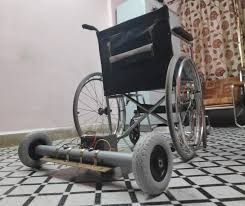

# Brain-Controlled Wheelchair (BCW)

A non-invasive **EEG-driven** control system for a powered wheelchair. It decodes brain signals (SSVEP / Motor Imagery) into **Forward / Left / Right / Stop** with strong safety (obstacle override, kill-switch, dead-man stop).

> ⚠️ Research project — not a medical device. Test at low speed, with a handler, in safe areas.

## ✨ Features
- EEG decoding (SSVEP or Motor Imagery)
- Debounced state machine (dwell time + confidence)
- Obstacle safety layer (ultrasonic/LiDAR → auto STOP)
- MCU interface (PWM/ADC or UART/CAN)
- Calibration UI + live plots
- Structured logs for analysis

## 🧱 Architecture

---

## 🧭 System Architecture

## ⚙️ Signal-Processing Pipeline

## 📸 Project Photos

  
  

